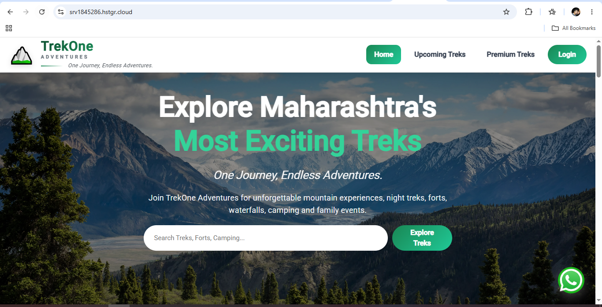

# TrekOne Frontend

A modern and responsive Adventure Trek Booking Platform built with **Angular 17**. The application provides a seamless trekking experience with secure authentication, online booking, Razorpay payment integration, refund & cancellation workflow, and role-based access for Admin and Customers.

---


## Features

- User Registration & Login
- JWT Authentication
- Forgot & Reset Password
- Role-Based Authentication (Admin & Customer)
- Trek Listing & Trek Details
- Advanced Trek Search & Filtering
- Online Booking Flow
- Razorpay Payment Integration
- Booking Cancellation & Refund
- My Bookings
- Reviews & Ratings
- Batch Selection
- Responsive UI
- Angular Lazy Loading
- Route Guards & HTTP Interceptors
- Toast Notifications
- REST API Integration with Express.js Backend
---

## Tech Stack

- Angular 17.2.3
- Bootstrap 5
- ngx-toastr
- TypeScript
- RxJS
- JWT Authentication
- Razorpay
- REST API Integration (Express.js Backend)
- MongoDB Atlas
- Git

---

## Architecture

```
Components
     │
Services
     │
HTTP Client
     │
Express.js REST API
     │
MongoDB Atlas
```

---

## Deployment

- Firebase Hosting
- AWS S3 Static Website Hosting
- Docker Containerization
- Hostinger VPS Deployment using Docker & Nginx
- GitHub Actions CI/CD Pipeline

---

## Run Locally
```bash
git clone https://github.com/divinearcs1-star/trekone-frontend.git

cd trekone-frontend

npm install

ng serve --open
```

Application runs at:
```
http://localhost:4200
```

---

## Highlights
- Built using Angular 17 with Modular Architecture
- Responsive UI using Bootstrap
- JWT Authentication with Route Guards
- Lazy Loaded Feature Modules
- REST API Integration with Express.js Backend
- Secure Online Payments using Razorpay
- Automated Docker Deployment using GitHub Actions
- Production Deployment on Firebase, AWS S3 & Hostinger VPS
---

## Author
Pankaj Belote